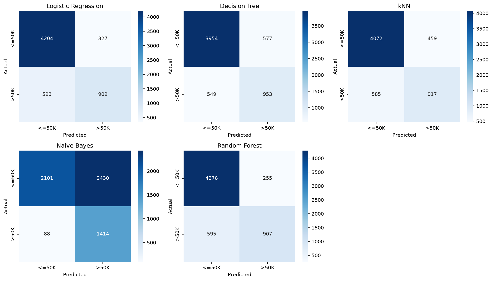
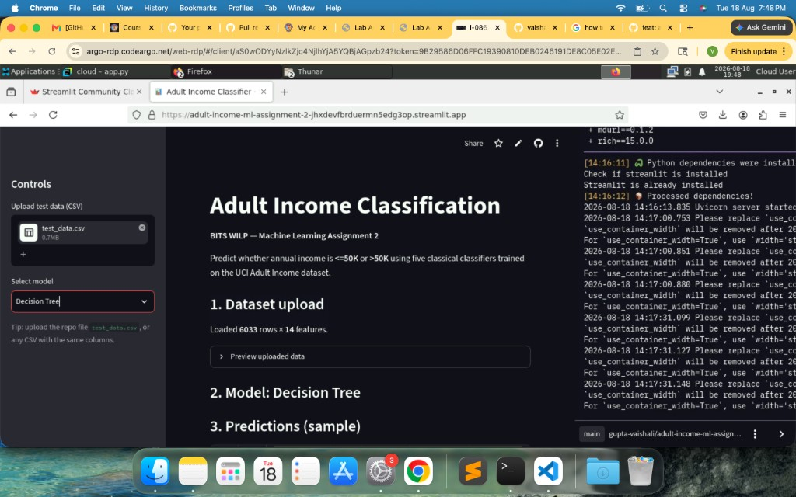
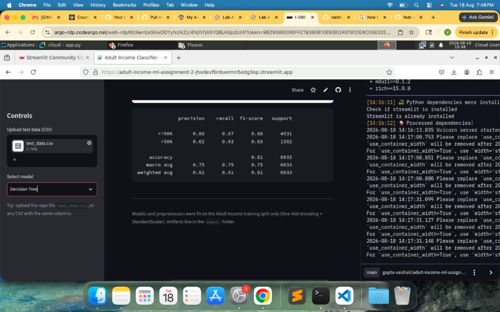

# Adult Income Classification — ML Assignment 2

**BITS WILP — Machine Learning Assignment 2**  
**Student:** Vaishali Gupta | **BITS ID:** 2025AC05539

---

## Submission links 

1. **GitHub Repository:** [https://github.com/Gupta-Vaishali/adult-income-ml-assignment-2](https://github.com/Gupta-Vaishali/adult-income-ml-assignment-2)
2. **Live Streamlit App:** [https://adult-income-ml-assignment-2-jhxdevfbrduermn5edg3op.streamlit.app/](https://adult-income-ml-assignment-2-jhxdevfbrduermn5edg3op.streamlit.app/)

---

## a. Problem statement

Predict whether an individual’s annual income is **`<=50K`** or **`>50K`** using demographic and employment attributes from the **UCI Adult Income (Census Income)** dataset.

This assignment implements a complete ML workflow:

- Load and clean a public classification dataset (≥12 features, ≥500 instances)
- Perform EDA
- Create a stratified train/test split
- Apply scaling and One-Hot encoding (fit on train only)
- Train **five** classifiers on the same data
- Evaluate with Accuracy, AUC, Precision, Recall, F1, and MCC
- Export models + scaler + encoder as `.pkl` files
- Serve results through a Streamlit app (`app.py`) with CSV upload, model dropdown, metrics, and confusion matrix / classification report
- Deploy the app on Streamlit Community Cloud and demonstrate execution on BITS Virtual Lab

Primary experiment notebook: `ml_pipeline.ipynb`  
Streamlit application: `app.py`

---

## b. Dataset description

| Item | Detail |
|------|--------|
| Dataset | Adult Income / Census Income |
| Source | [UCI ML Repository — Adult](https://archive.ics.uci.edu/dataset/2/adult) |
| Task | Binary classification |
| Target | `income` ∈ {`<=50K`, `>50K`} |
| Features | **14** (requirement ≥ 12) |
| Instances after cleaning | **30,162** (requirement ≥ 500) |
| Class balance | `<=50K`: 22,654 (**75.11%**) · `>50K`: 7,508 (**24.89%**) |

### Feature list

**Numeric (6):** `age`, `fnlwgt`, `education_num`, `capital_gain`, `capital_loss`, `hours_per_week`

**Categorical (8):** `workclass`, `education`, `marital_status`, `occupation`, `relationship`, `race`, `sex`, `native_country`

### Cleaning steps

- Treat `?` as missing and drop incomplete rows
- Strip whitespace and normalize target labels (remove trailing `.` if present)
- After cleaning: **0** missing values; shape **30,162 × 15** (14 features + target)

---

## Exploratory Data Analysis (EDA)

EDA was performed in `ml_pipeline.ipynb` before modeling.

### Key findings

1. **Class imbalance:** About **3:1** majority (`<=50K`) vs minority (`>50K`). Accuracy alone can look high; AUC, F1, and MCC are needed for fair comparison.
2. **Feature mix:** Both continuous and categorical predictors matter (employment type, education, hours, capital gains/losses).
3. **Age vs income:** Higher-income group tends to be older on average (visible in age distribution by class).
4. **No missing values after cleaning:** Modeling proceeds on a complete cleaned table.

### Class distribution

| Income class | Count | Proportion |
|--------------|------:|-----------:|
| `<=50K` | 22,654 | 0.7511 |
| `>50K` | 7,508 | 0.2489 |

---

## Train / test split and preprocessing

| Step | Choice |
|------|--------|
| Split | Stratified `train_test_split` |
| Test size | **20%** |
| Random state | **42** |
| Train rows | **24,129** |
| Test rows | **6,033** (saved as `test_data.csv`) |
| Numeric scaling | `StandardScaler` (fit on train only) |
| Categorical encoding | `OneHotEncoder(handle_unknown="ignore")` (fit on train only) |
| Target encoding | `LabelEncoder` (`<=50K` → 0, `>50K` → 1) |

Exported artifacts in `model/`:

- `scaler.pkl`, `encoder.pkl`, `preprocessor.pkl`, `label_encoder.pkl`
- `logistic_regression.pkl`, `decision_tree.pkl`, `knn.pkl`, `naive_bayes.pkl`, `random_forest.pkl`

---

## c. GitHub Repository Link

**https://github.com/Gupta-Vaishali/adult-income-ml-assignment-2**

Repository includes: `app.py`, `ml_pipeline.ipynb`, `requirements.txt`, `README.md`, `test_data.csv`, and `model/*.pkl`.

**Live Streamlit App:**  
**https://adult-income-ml-assignment-2-jhxdevfbrduermn5edg3op.streamlit.app/**

---

## d. Models used

All models trained on the same preprocessed training set and evaluated on the same hold-out test set (`test_data.csv`, 6,033 rows).

1. Logistic Regression  
2. Decision Tree Classifier  
3. K-Nearest Neighbors (k = 5)  
4. Naive Bayes (GaussianNB)  
5. Random Forest (Ensemble)

### Comparison table (test set)

| ML Model Name | Accuracy | AUC | Precision | Recall | F1 | MCC |
|---|---:|---:|---:|---:|---:|---:|
| Logistic Regression | 0.8475 | 0.9022 | 0.7354 | 0.6052 | 0.6640 | 0.5711 |
| Decision Tree | 0.8134 | 0.7536 | 0.6229 | 0.6345 | 0.6286 | 0.5040 |
| kNN | 0.8270 | 0.8595 | 0.6664 | 0.6105 | 0.6372 | 0.5248 |
| Naive Bayes | 0.5826 | 0.8018 | 0.3678 | 0.9414 | 0.5290 | 0.3643 |
| Random Forest (Ensemble) | 0.8591 | 0.9158 | 0.7806 | 0.6039 | 0.6809 | 0.6004 |

*(Precision / Recall / F1 / MCC are for the positive class `>50K`; AUC is ROC-AUC.)*

### Observations on model performance

| ML Model Name | Observation about model performance |
|---|---|
| Logistic Regression | Strong linear baseline (Accuracy 0.85, AUC 0.90). Solid precision on `>50K`; recall limited by class imbalance. |
| Decision Tree | Decent Accuracy (0.81) but weaker AUC (0.75) and MCC — single tree overfits relative to the ensemble. |
| kNN | Mid-tier (Accuracy 0.83, F1 0.64). Works after scaling, but high-dimensional one-hot space limits neighborhood quality. |
| Naive Bayes | Lowest Accuracy (0.58) and MCC. Very high recall but poor precision — over-predicts `>50K` on sparse one-hot features. |
| Random Forest (Ensemble) | Best Accuracy, AUC, F1, and MCC. Most reliable under mild imbalance. |
| **Overall Winner for your dataset?** | **Random Forest (Ensemble)** |

### Ranking by F1

1. **Random Forest — 0.6809 (best)**  
2. Logistic Regression — 0.6640  
3. kNN — 0.6372  
4. Decision Tree — 0.6286  
5. Naive Bayes — 0.5290  

---

## Confusion matrices (test set)

Rows = Actual, Columns = Predicted. Order of labels: `[<=50K, >50K]`.

### Random Forest (best model)

|  | Pred `<=50K` | Pred `>50K` |
|--|-------------:|------------:|
| Actual `<=50K` | 4276 | 255 |
| Actual `>50K` | 595 | 907 |

### Logistic Regression

|  | Pred `<=50K` | Pred `>50K` |
|--|-------------:|------------:|
| Actual `<=50K` | 4204 | 327 |
| Actual `>50K` | 593 | 909 |

### Decision Tree

|  | Pred `<=50K` | Pred `>50K` |
|--|-------------:|------------:|
| Actual `<=50K` | 3954 | 577 |
| Actual `>50K` | 549 | 953 |

### kNN

|  | Pred `<=50K` | Pred `>50K` |
|--|-------------:|------------:|
| Actual `<=50K` | 4072 | 459 |
| Actual `>50K` | 585 | 917 |

### Naive Bayes

|  | Pred `<=50K` | Pred `>50K` |
|--|-------------:|------------:|
| Actual `<=50K` | 2101 | 2430 |
| Actual `>50K` | 88 | 1414 |



---

## Classification reports (test set)

### Random Forest (best)

```text
              precision    recall  f1-score   support
       <=50K       0.88      0.94      0.91      4531
        >50K       0.78      0.60      0.68      1502
    accuracy                           0.86      6033
   macro avg       0.83      0.77      0.80      6033
weighted avg       0.85      0.86      0.85      6033
```

### Logistic Regression

```text
              precision    recall  f1-score   support
       <=50K       0.88      0.93      0.90      4531
        >50K       0.74      0.61      0.66      1502
    accuracy                           0.85      6033
   macro avg       0.81      0.77      0.78      6033
weighted avg       0.84      0.85      0.84      6033
```

### Decision Tree

```text
              precision    recall  f1-score   support
       <=50K       0.88      0.87      0.88      4531
        >50K       0.62      0.63      0.63      1502
    accuracy                           0.81      6033
   macro avg       0.75      0.75      0.75      6033
weighted avg       0.81      0.81      0.81      6033
```

### kNN

```text
              precision    recall  f1-score   support
       <=50K       0.87      0.90      0.89      4531
        >50K       0.67      0.61      0.64      1502
    accuracy                           0.83      6033
   macro avg       0.77      0.75      0.76      6033
weighted avg       0.82      0.83      0.82      6033
```

### Naive Bayes

```text
              precision    recall  f1-score   support
       <=50K       0.96      0.46      0.63      4531
        >50K       0.37      0.94      0.53      1502
    accuracy                           0.58      6033
   macro avg       0.66      0.70      0.58      6033
weighted avg       0.81      0.58      0.60      6033
```

---

## Best performing model

**Winner: Random Forest (Ensemble)**

| Why it wins | Evidence on test set |
|-------------|----------------------|
| Highest Accuracy | **0.8591** |
| Highest AUC | **0.9158** |
| Highest F1 (`>50K`) | **0.6809** |
| Highest MCC | **0.6004** |
| Best precision among strong models | **0.7806** on `>50K` |

Random Forest reduces variance versus a single Decision Tree while keeping strong discrimination under class imbalance, making it the most reliable model for this dataset.

---

## Streamlit application

### App features implemented

- Upload test CSV (`test_data.csv`)
- Model selection dropdown (all 5 models)
- Display of evaluation metrics
- Confusion matrix and classification report

### Live deployed app

[https://adult-income-ml-assignment-2-jhxdevfbrduermn5edg3op.streamlit.app/](https://adult-income-ml-assignment-2-jhxdevfbrduermn5edg3op.streamlit.app/)

### Screenshots (proof)

**1. App running with uploaded `test_data.csv` and model selection (Decision Tree):**



**2. Classification report / evaluation output in the deployed app:**



**3. BITS Virtual Lab execution proof :**


